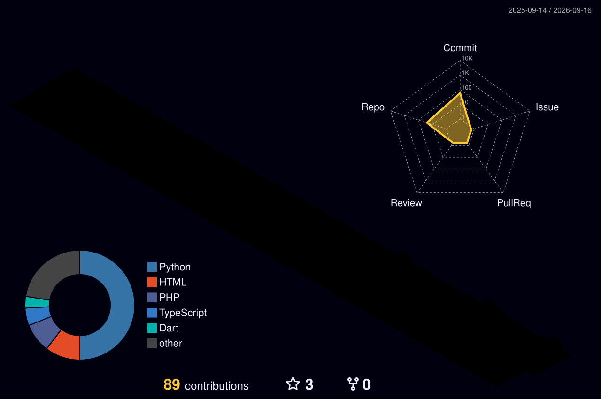
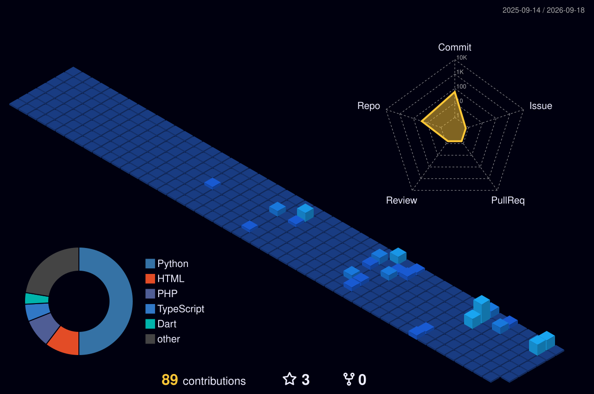
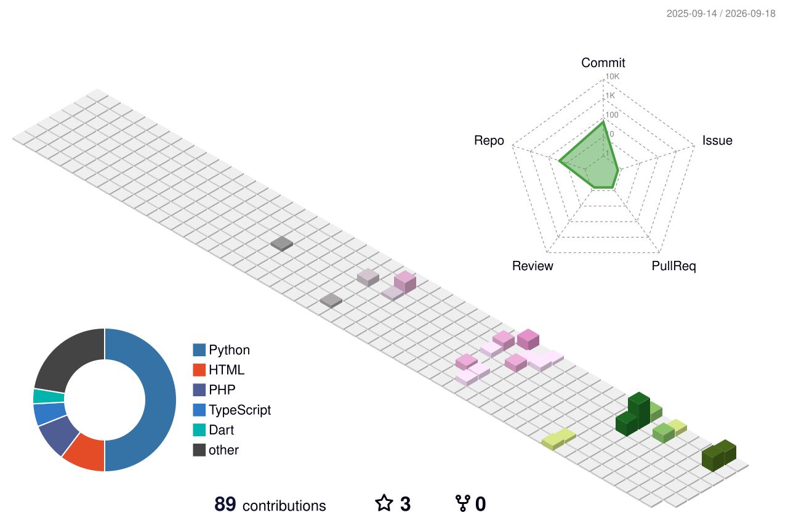
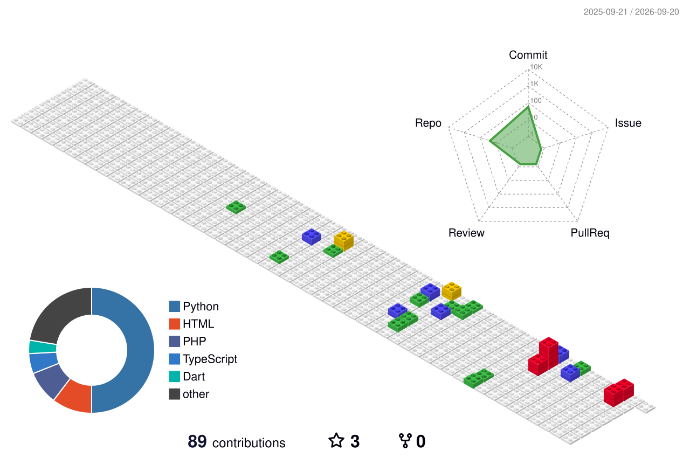

<!-- 4K CYBER NEON PREMIUM — FULL 4D IMMERSIVE -->

  
  
  
  
  

  
  
  
  

  
  
  

>  *“Membangun teknologi yang tidak hanya canggih, tetapi juga menyelesaikan masalah nyata bagi penggunanya.”* — **Bridging the gap between technology, business, and real user needs.**

<!-- TOC 4K -->

| [Tentang](#-tentang-saya) | [Tech Stack](#-tech-stack) | [Proyek](#-proyek-unggulan) | [Pengalaman](#-pengalaman-profesional) | [Statistik](#-github-statistik--aktivitas) | [Game Zone](#-game-zone--cyber-neon-arcade) | [Kontak](#-terbuka-untuk-peluang) |
|:---:|:---:|:---:|:---:|:---:|:---:|:---:|

---

##  Tentang Saya

<table>
<tr>
<td width="60%" valign="top">

Saya adalah **Mahasiswa Teknik Informatika di Universitas Harkat Negeri** yang antusias di **Artificial Intelligence & Software Engineering**.

**Fokus utama:**
> **Python & Data Processing • Machine Learning & Deep Learning • LLM & RAG • Pengembangan Aplikasi Berbasis AI • Full-Stack Web Development (JavaScript, React.js, MERN Stack: MongoDB, Express.js, React, Node.js)**

**Yang membedakan: Saya tidak hanya teori.**  
Saya **aktif membangun WEBSITE FULL-STACK untuk KLIEN NYATA** — teman, kenalan, bisnis lokal. Produk **benar-benar dipakai**: *landing page klinik, dasbor admin, profil hotel ByLian, template portfolio profesional*. Terbiasa mengubah kebutuhan pengguna jadi produk digital **fungsional & siap pakai**.

**Passion:** Integrasi **LLM & RAG** ke web modern untuk solusi cerdas & berdampak.

> 💡 **Motto:** `Learning by building. One project at a time.`

**Nilai tambah unik:** Latar belakang **Sales & Leadership** (Sales Associate, Supervisor, Account Executive @ Home Credit & Mora Republic). Paham **pasar & perilaku pelanggan** — solusi saya **tidak hanya berfungsi, tapi bernilai bisnis.**

*Terbuka untuk magang, kolaborasi, freelance full-stack.*

</td>
<td width="40%" align="center" valign="top">

 

  
   
  
   
  

**📍 Tegal, Jawa Tengah** 
**📧 abymanyunwr03@gmail.com** 
**📱 0851-7169-0141** 
**💼 @bym4nyu**

</td>
</tr>
</table>

---

##  Tech Stack

 

| Kategori | Skills |
|:---------|:-------|
| **🚀 Teknologi & Pemrograman** | Python, Data Processing, ML, Deep Learning, LLM, RAG, JS/TS, React.js, MERN (MongoDB, Express, React, Node), Full-Stack untuk KLIEN NYATA |
| **💼 Sales & Marketing** | Follow-up, Prospecting, Komunikasi Persuasif, Negosiasi, Closing, Upselling, Customer Handling |
| **📣 Digital Marketing** | Social Media, Content Planning, Meta Ads, Optimasi, Analisis Performa |
| **🗂️ Administrasi** | Input Data, Pesanan, Stok, Listing, Pembayaran, Pengiriman |
| **🔧 Teknik & Maintenance** | Perawatan Mesin, Sistem Mekanik, Checklist, Troubleshooting, K3 |
| **🛠️ Tools** | Word, Excel, Docs, Sheets, Canva, Figma, CapCut, Lightroom, Meta Ads Manager, VS Code, Docker |
| **🤝 Soft Skills** | Komunikatif, Teliti, Disiplin, Adaptif, Target-oriented, Teamwork, Problem Solving, Leadership |

---

##  Proyek Unggulan

> **Semua proyek untuk KLIEN NYATA — deploy & dipakai pengguna akhir.** Bukan tugas kuliah.

| # | Proyek | Untuk Siapa & Deskripsi | Tech | Link |
|:---:|--------|--------------------------|------|------|
| 1 | **🏥 dasbor-admin-klinik** | Dashboard klinik — kelola pasien, jadwal, laporan. **Klien klinik nyata.** | Python, Full-Stack | [→ Repo](https://github.com/AbymanyuNWR/dasbor-admin-klinik) |
| 2 | **🏥 landing-page-klinik** | Landing page klinik profesional. **Klien klinik.** | JavaScript | [→ Repo](https://github.com/AbymanyuNWR/landing-page-klinik) |
| 3 | **🏨 Profile-Landing-Page — ByLian Hotel** | Etalase digital hotel ByLian & booking info. | JavaScript | [→ Repo](https://github.com/AbymanyuNWR/Profile-Landing-Page---ByLian-Hotel) |
| 4 | **🛡️ ABYM-CYBER — Security Framework** | Framework siber professional-grade. | Python | [→ Repo](https://github.com/AbymanyuNWR/ABYM-CYBER---Professional-Grade-Cyber-Security-Framework) |
| 5 | **🎨 Template-Portofolio-Part-2** | Template portfolio modern & responsif. | TypeScript | [→ Repo](https://github.com/AbymanyuNWR/Template-Portofolio-Part-2---Abymanyu-Nur-Wakhid-Rokhiim) |
| 6 | **🚗 Template-Bylian — Ritel Otomotif** | Template bisnis otomotif/bengkel. | JavaScript | [→ Repo](https://github.com/AbymanyuNWR/Template-Bylian---Ritel-Otomotif) |
| 7 | **🌾 agriculture-ai-platform** | Prototype pertanian AI — data & ML. | Python, AI | [→ Repo](https://github.com/AbymanyuNWR/agriculture-ai-platform) |

> 🔥 **Di luar GitHub, saya rutin kerjakan proyek React/MERN custom untuk klien — aplikasi bisnis, sistem manajemen, profil perusahaan. Praktik nyata.**

---

##  Pengalaman Profesional

| Periode | Peran & Perusahaan | Highlight |
|:--------|:-------------------|:----------|
| **Jul 2025 – Jul 2026** | **Sales Associate — Home Credit Indonesia** | Capai target consultative selling & POS, handling keluhan, kontribusi target tim. |
| **Jun 2024 – Mei 2025** | **Supervisor Sales — Mora Republic** | Pimpin tim Canvassing, KPI & coaching, naikkan produktivitas, strategi lapangan. |
| **Mei 2024 – Okt 2024** | **Account Executive — Mora Republic** | Akuisisi door-to-door, presentasi & closing hingga instalasi. |
| **Nov 2023 – Feb 2024** | **Helper Mekanik (Magang) — PT Tegal Shipyard Utama** | Perawatan mekanik kapal, digitalisasi checklist maintenance, kolaborasi teknisi. |

---

##  Pendidikan

| Periode | Institusi | Fokus |
|:--------|:----------|:------|
| **Saat ini** | **Universitas Harkat Negeri** | Teknik Informatika — AI, ML, LLM/RAG, Full-Stack |
| **Lulusan** | **SMK N 3 Tegal** | Teknika Kapal — Mekanik & sistem kapal |

### 📜 Sertifikat

| Sertifikat | Kompetensi |
|:-----------|:-----------|
| **📋 Project Management** | Timeline, risiko, koordinasi tim, monitoring |
| **📱 Digital Marketing** | Strategi digital, content, Meta Ads, analisis |
| **📢 Social Media Specialist** | Planning, copywriting, optimasi, engagement |
| **👔 Digital Leadership** | Leadership, decision, transformasi digital |

---

##  GitHub Statistik & Aktivitas — 4K

 

 

 

<table>
<tr>
<td width="50%" align="center" valign="top">

**🌐 Visitor — 4K**

 

 

</td>
<td width="50%" align="center" valign="top">

**🏙️ 3D City Stack — 4K**

</td>
</tr>
</table>

> 📌 **Catatan:** Kontribusi publik rendah karena mayoritas proyek **private & offline untuk klien nyata**. Private commit terhitung.

---

##  Game Zone — Cyber Neon Arcade (4K)

### 🐍 SNAKE — 4K

*Ular neon bergerak tiap 6 jam via Actions*

### 🟡 PAC-MAN — 4K

### 🏙️ 3D Metropolis — 4K

---

| Game | Cara Main | Status |
|:-----|:----------|:-------|
| **Tic-Tac-Toe** | Issue → `!tictactoe` → bot balas | ✅ Aktif |
| **Chess** | Issues → Chess → lawan bot | ✅ Aktif |
| **Breakout** | Klik Breakout → full-screen | 🎯 External |
| **Snake & Pac-Man** | Otomatis tiap push | 🐍 Neon |
| **3D City** | Klik 3D city stack di atas | 🏙️ 4K |

---

##  Terbuka Untuk Peluang

### Mari Berkolaborasi! 🚀

| Peluang | Deskripsi |
|:--------|:----------|
| **🎓 Magang** | AI / Software / Data / Business |
| **💻 Freelance** | Full-Stack React/MERN untuk UMKM & bisnis |
| **🤝 Kolaborasi** | AI Platform & Open Source |
| **💼 Full-Time** | AI, Software Dev, Digital Marketing |

**Bidang:** `AI • Software Dev • Data • Digital Marketing • Business Dev`

*📩 Balas cepat — senang diskusi ide proyek baru!*

---

## 🎯 Visi Karir

> Saya ingin mengembangkan **sistem AI & aplikasi full-stack** yang tidak hanya berfungsi teknis, tapi juga **menyelesaikan kebutuhan bisnis & pengguna secara nyata.**
>
> Perpaduan **Informatika + produk untuk klien + sales & marketing** membuat saya mampu **menjembatani teknologi & pasar.**

---

 

 

---

**© 2026 Abymanyu Nur Wakhid Rokhiim — @bym4nyu**

*Dibuat dengan ❤️, ☕, dan banyak `commit` di Tegal, Jawa Tengah*

 

<picture>
  <source media="(prefers-color-scheme: dark)" srcset="https://raw.githubusercontent.com/AbymanyuNWR/AbymanyuNWR/output/github-contribution-grid-snake-dark.svg">
  <source media="(prefers-color-scheme: light)" srcset="https://raw.githubusercontent.com/AbymanyuNWR/AbymanyuNWR/output/github-contribution-grid-snake.svg">
  
</picture>

